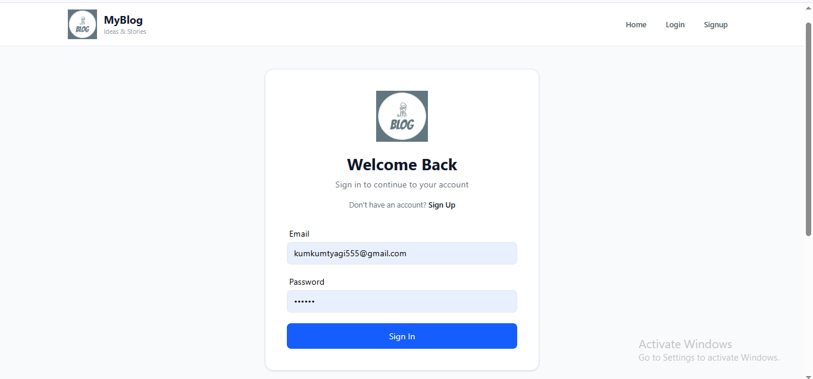
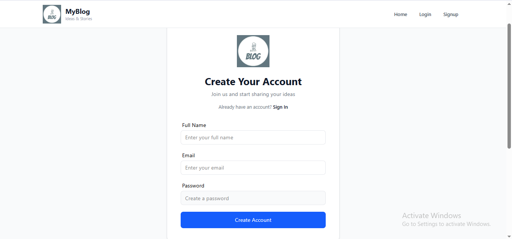
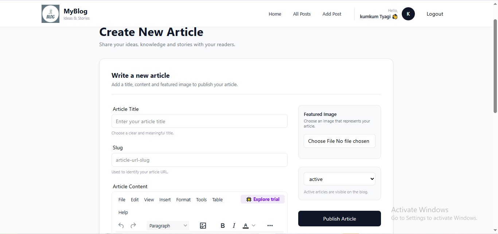

# 📝 Blog Application

A modern and responsive blog application built with **React.js, Vite, Tailwind CSS, and Appwrite**.

The application allows users to register and log in, create articles, upload featured images, and read published articles through a clean and responsive interface.

## ✨ Features

* 🔐 User Registration & Login
* 📝 Create Articles
* 📖 Read Articles
* ✍️ Rich Text Editor
* 🖼️ Featured Image Upload
* 🗄️ Appwrite Database
* ☁️ Appwrite Storage
* ⚡ Fast React + Vite application
* 📱 Responsive Design
* 🔒 Protected User Features

## 🛠️ Tech Stack

* **Frontend:** React.js
* **Build Tool:** Vite
* **Styling:** Tailwind CSS
* **Backend / BaaS:** Appwrite
* **Database:** Appwrite TablesDB
* **Authentication:** Appwrite Authentication
* **Storage:** Appwrite Storage
* **Routing:** React Router
* **State Management:** Redux Toolkit
* **Rich Text Editor:** TinyMCE
* **Version Control:** Git & GitHub

## 📸 Screenshots

### 🏠 Home Page


### 🔐 Sign In



### 📝 Sign Up



### ✍️ Add Article



### 📚 All Posts


## 🚀 Getting Started

### Prerequisites

Make sure you have **Node.js** and **npm** installed on your system.

### 1. Clone the repository

```bash
git clone YOUR_GITHUB_REPOSITORY_URL
```

### 2. Open the project folder

```bash
cd YOUR_PROJECT_FOLDER
```

### 3. Install dependencies

```bash
npm install
```

### 4. Set up environment variables

Create a `.env` file in the project root.

Use `.env.sample` as a reference and add your Appwrite configuration.

> Never upload your `.env` file to GitHub.

### 5. Start the development server

```bash
npm run dev
```

Open the local URL shown in your terminal to view the application.

## 🔒 Environment Variables

This project uses environment variables for Appwrite configuration.

The repository includes `.env.sample` with placeholder values.

For security reasons, the actual `.env` file is not included in the repository.

## 📁 Project Structure

```text
project/
├── public/
│   └── screenshots/
│       ├── Home.png
│       ├── SignIn.png
│       ├── SignUp.png
│       ├── AddArticle.png
│       └── AllPosts.png
├── src/
│   ├── appwrite/
│   ├── components/
│   ├── pages/
│   ├── store/
│   ├── App.jsx
│   └── main.jsx
├── .env.sample
├── .gitignore
├── package.json
└── README.md
```

## 🚀 Future Improvements

* 🔎 Advanced Article Search
* 🏷️ Categories and Tags
* 💬 Comments and Likes
* ❤️ Bookmarks
* 👤 User Profile
* 📊 User Dashboard

## 👩‍💻 Author

**Kumkum Tyagi**

Computer Science Student | Aspiring Full Stack Developer

---

⭐ If you like this project, consider giving it a star!
